# Traffic Rules Violation Detection with Computer Vision

> (Everything is not completed)

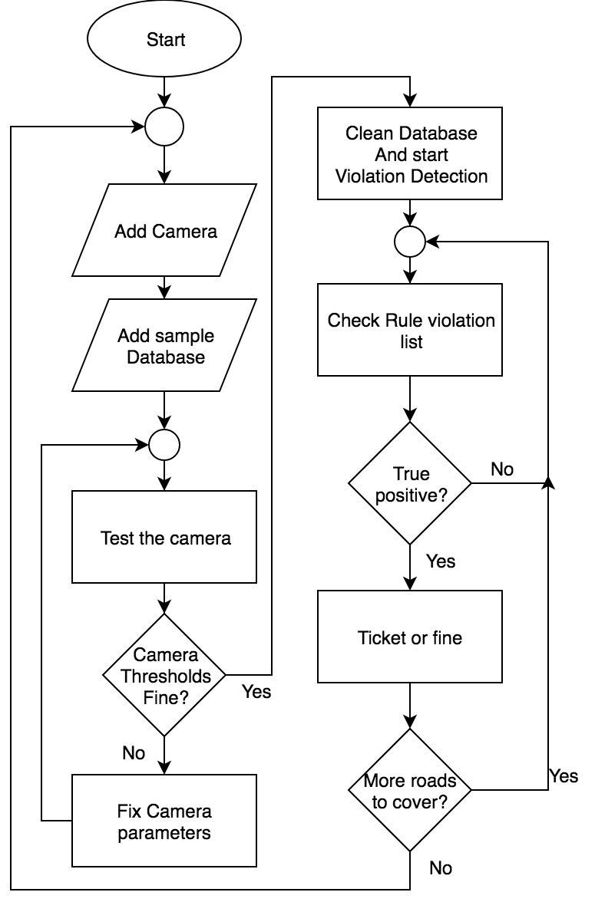
This is a software for practice of developing a system from completely scratch. Understanding this will help a lot in system development and basic structure of a system along with computer vision, GUI with python library PyQt and basic opencv.

Go [here](#quick-starting-the-project) if you don't have time.

## Table of content

- [Motivation](#motivation)
- [Introduction](#introduction)
- [Objective](#objective)
- [Quick Starting the project](#quick-starting-the-project)
- [System Overview](#system-overview)
- [Methodology](#methodology)
  - [Image Processing](#image-processing)
  - [Vehicle Classification](#vehicle-classification)
  - [Violation Detection](#violation-detection)
  - [Database Structure](#database-structure)
- [Implementation](#implementation)
  - [Image Processing and Computer Vision](#image-processing-and-computer-vision)
  - [Graphical User Interface](#graphical-user-interface-gui)
  - [Rules Violation Video Representation](#rules-violation-video-representation-in-ui)
- [Licensing](#licensing)

## Motivation

This project is made for the third semester of the second year for Project Exhibition 2.

## Introduction

The rising number of vehicles in urban areas has led to increased traffic congestion, making traffic violations a critical issue globally. These violations not only cause significant property damage but also result in accidents that threaten public safety. To address this growing concern and prevent disastrous consequences, the implementation of traffic violation detection systems has become essential. These systems ensure that traffic regulations are enforced at all times and offenders are swiftly apprehended.

A real-time traffic violation detection system allows authorities to continuously monitor roads, enhancing both accuracy and efficiency in maintaining road safety. With such systems, traffic enforcers can rely on faster, more precise detection of violations than manual observation allows. The system is capable of identifying the three most common types of violations in real-time: signal violations, parking violations, and wrong-direction driving.

To facilitate ease of use, the system includes a user-friendly graphical interface, allowing users to effortlessly operate the system, monitor traffic, and take necessary actions against violators. By streamlining enforcement, this system promotes safer roads for everyone.

## Objective

The goal of this project is to automate the traffic violation detection system, making it easier for the traffic police department to monitor traffic and take swift, efficient action against violators. The system aims to enhance the speed and accuracy of enforcement, ensuring that traffic regulations are upheld. The primary focus is on accurately detecting and tracking vehicles and their activities to effectively identify violations and take appropriate measures.

## Quick starting the project

1. `git clone https://github.com/rahatzamancse/EyeTask.git`
2. Install required python dependencies from `requirements.txt` into your python virtual environment. (`pip install -r requirements.txt`)
3. `python main.py`

## System Overview

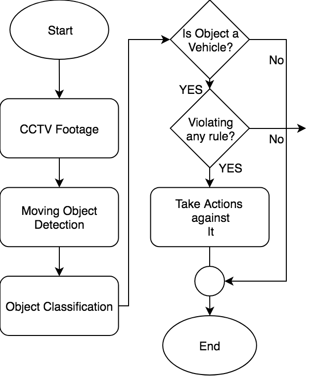

The System consists of two main components -

* Vehicle detection model and
* A graphical user interface (GUI)

First, the CCTV camera footage from the roadside is transmitted to the system, where vehicles are detected from the footage. The system tracks vehicle activities and determines whether any traffic violations have occurred. Different types of violations—such as signal violations, parking violations, and wrong-direction driving—are detected using specific algorithms tailored to each violation. The system's flow, illustrated in Flowchart 1, demonstrates how it operates.

The Graphical User Interface (GUI) enhances the system's interactivity, allowing the user to monitor traffic footage in real-time and receive alerts when a violation is detected, complete with a captured image of the offending vehicle. Through the GUI, the user can then take appropriate further actions, streamlining the process for traffic enforcement.

## Methodology

### Image Processing

1. **Grayscaling and Blurring**
As part of the preprocessing of the input frame obtained from the CCTV footage, the image is first converted to grayscale. This simplifies the image by removing color information, leaving only intensity values. The grayscale image is then blurred using the Gaussian Blur method, which helps reduce noise and detail, making it easier to focus on key features.

2. **Background Subtraction**
To isolate moving objects from the background, background subtraction is employed. This method subtracts the current frame from a reference frame to highlight the areas where movement (i.e., vehicles) is detected. The operation is represented by the following equation:
dst(I) = saturate(|scr1(I) − scr2(I)|)
Here, scr1(I) and scr2(I) refer to the pixel intensities of the two frames, and the result gives the region of interest (i.e., the moving vehicle).

3. **Binary Threshold**
Binarization is applied to eliminate noise and clearly define the desired object areas. This process converts the grayscale image into a binary image, where pixels are set to either the maximum value (white) if they exceed a specified threshold or to zero (black) otherwise. The binary thresholding equation is:
dst(x, y) = maxVal if scr(x, y) > thresh else 0
This step ensures a clear distinction between the object and the background.

4. **Dilation and Contour Detection**
Once the binary image is generated, dilation is performed to close small holes within the detected object, making it more continuous. After dilation, the system identifies contours, or outlines, in the image. A bounding rectangle is drawn around these contours to highlight the moving objects, such as vehicles, ensuring they are accurately tracked.

### Vehicle Classification

From the preprocessed image, moving objects are extracted. A vehicle classification model is then applied to categorize these moving objects into three classes: Car, Motorbike, and Non-vehicle. The classification model is built using the MobileNet V1 neural network architecture, which is known for its efficiency in terms of both speed and accuracy, making it ideal for real-time detection scenarios. This architecture allows the system to quickly and accurately distinguish between different types of vehicles and non-vehicle objects, ensuring precise classification and minimizing false detections.

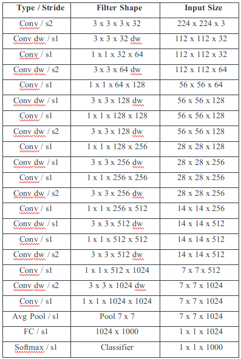

Fig: MobileNet Body Architecture.

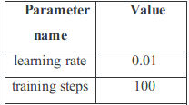

Fig-2: Trainning hyperparameters.

A transfer learning approach is used to train the model on our dataset, leveraging the pre-trained MobileNet V1 architecture to improve efficiency and accuracy with limited data. The dataset consists of 500 images per class—Car, Motorbike, and Non-vehicle—ensuring a balanced representation of each category.

The training parameters for the model, which include key settings like learning rate, batch size, and number of epochs, are detailed in Table (2), ensuring the model is fine-tuned for optimal performance on the given dataset. By applying transfer learning, the model benefits from pre-existing knowledge while adapting to our specific dataset, leading to faster convergence and improved classification accuracy.

### Violation detection

After detecting the vehicles, the system identifies three possible types of traffic violations:

*Signal Violation: A signal violation is detected when a vehicle crosses a predefined line on the road while the traffic light is red. The system continuously monitors the vehicle's position in relation to the signal and line to determine this violation.

*Parking Violation: If a vehicle remains stationary in a no-parking zone for a predefined period, the system detects it as a parking violation. The system uses time-tracking to ensure that only vehicles violating the parking rule for an extended period are flagged.

*Direction Violation: A direction violation occurs when a vehicle moves in the wrong direction on the road. The system tracks the vehicle's movement by analyzing its current position and comparing it to its previous positions. If the trajectory indicates movement against the permitted direction, the system flags it as a direction violation.

### Database Structure

We utilized an SQLite database with Python to manage the data for our application. In the relational database, we ensured the normalization of the data by applying Boyce-Codd Normal Form (BCNF) across five tables. These tables are designed to efficiently store and manage the necessary information for the traffic violation detection system:

1. Cars: This table stores information about detected vehicles, including details such as license plate number, vehicle type (car, motorbike, etc.), and other relevant data.

2. Rules: Contains data related to the traffic rules being enforced, such as the allowed signal timing, no-parking zones, and speed limits.

3. Cameras: Stores information about the CCTV cameras, including their location, ID, and the roads or areas they monitor.

4. Violations: Records details of any traffic violations detected by the system, including the vehicle involved, the type of violation (signal, parking, or direction), time, and location.

5. Groups: Organizes data related to different groups or categories that may be used for administrative purposes, such as categorizing cameras or violations based on geographic regions or priority levels.

By structuring the database in BCNF, we ensure that the data is free of redundancy and maintain efficient data retrieval and storage.

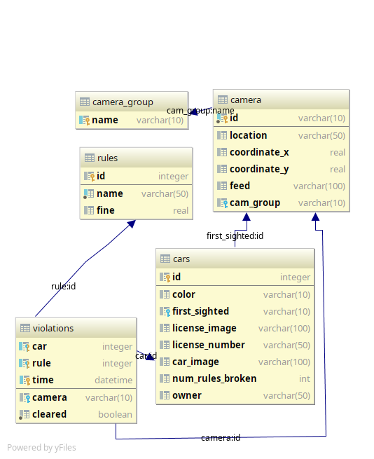

** Here are the descriptions of each tables: **

#### Cars Table
This table records details about cars captured by the camera. Each car is represented by the following attributes:

* ID: A unique identifier for the car.
* Color: The color of the car.
* License Number: The car's license plate number.
* First Sighted: The date and time when the car was first detected.
* License Image: An image of the license plate.
* Car Image: An image of the car.
* Number of Rules Broken: The count of traffic rules the car has violated.
* Owner: The name of the car owner.

#### Rules Table
This table outlines the traffic rules along with their descriptions and the associated fines:

* ID: A unique identifier for each rule.
* Name: The description of the rule.
* Fine: The penalty amount for breaking the rule.

#### Camera Table
This table maintains details about each camera:

* ID: A unique identifier for the camera.
* Location: A textual description of the camera’s location.
* Longitude (Coordinate X): The longitude of the camera’s location.
* Latitude (Coordinate Y): The latitude of the camera’s location.
* Feed: The video feed URL from the camera.
* Group: The group to which the camera belongs.

#### Camera Group Table

This table records the unique names of camera groups:

* Name: The unique identifier for each camera group.

#### Violations Table
This table logs the violations detected:

* Car ID: The ID of the car that committed the violation.
* Rule ID: The ID of the rule that was broken.
* Violation Time: The date and time when the violation occurred.
* Camera ID: The ID of the camera that captured the violation.

#### Implementation

* Image Processing and Computer Vision
Image processing is handled using the OpenCV library in Python, while TensorFlow is employed for machine learning tasks, such as vehicle classification.

* Graphical User Interface (GUI)
The GUI is designed to provide an administrative interface and debugging tools, eliminating the need for code modifications for routine management tasks. Through the interface, users can easily add sample cars or cameras to the database and perform other management functions (see Fig-3).

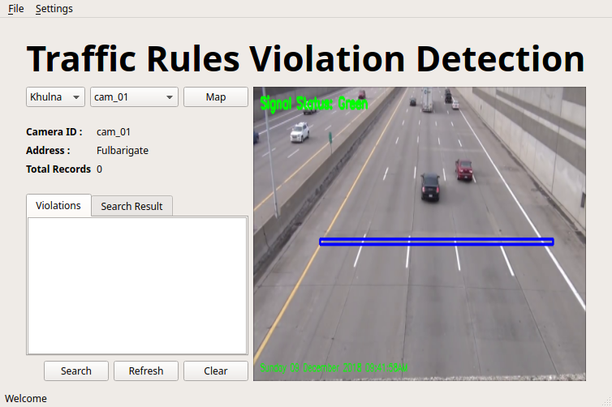

Figure 2: Overall user interface view

At the start of the project, the administrator will need to configure the camera through the provided menu item. The setup process includes:

* Adding Camera Details: The administrator will input the camera's location and upload the feed file. This file is supplied by the camera module over the internet.

* Feed File Management: The system uses a Linux file-sharing pattern to receive video feeds from the camera. The camera uploads the feed file to the server, where it is processed to detect any violations.

* Coordinate Configuration: The administrator will also input the X and Y coordinates of the camera’s location (refer to Fig-3). This information is crucial for future integrations, such as mapping the camera locations for easier navigation and management.

* Rule Specification: The administrator must define the rules associated with the camera using a JSON file. This could include specifications such as detecting red light violations at a crossroad or identifying incorrect parking.

By providing these details, the system ensures that cameras are properly set up and their feeds are effectively managed for accurate violation detection.

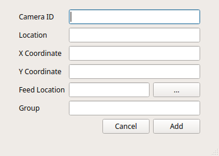

Figure 3: Interface for adding camera entity

For the initial setup of the system, the administrator needs to:

* Add Camera Details: Enter the camera’s location and upload the feed file. This file is provided by the camera module over the internet.

* Manage Feed Files: The system uses a Linux file-sharing pattern to receive and process video feeds from the camera. The camera uploads the feed file to the server, where it is used for violation detection.

* Configure Coordinates: Input the X and Y coordinates of the camera’s location (see Fig-3) for future mapping and management purposes.

* Specify Detection Rules: Define the camera's rules via a JSON file. Examples include monitoring for red light violations at crossroads or detecting improper parking.

Once the camera is added and configured, the software will automatically begin detecting traffic rule violations. To review the detected violations, the administrator can select the camera from a drop-down menu. This action will display the violation records associated with that camera (refer to Fig-4).

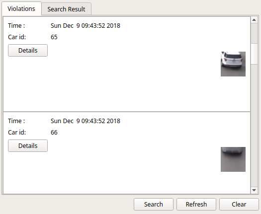

Figure 4: List view of violation records

The graphical user interface (GUI) enables the administrator to manage various entities in the database. The admin can add the following objects through the GUI:

1. Camera: Add new camera details, including location, feed file, and associated rules (see Fig-3).

2. Car: Register information about a car, such as its ID, color, license number, first sighted timestamp, and images (see Fig-5).

3. Rule: Define new traffic rules, including their descriptions and fines (see Fig-5).

4. Violation: Record violations detected by cameras, including which car violated which rule and the time of violation (see Fig-5).

The GUI provides a user-friendly interface to facilitate the addition and management of these entities, ensuring efficient and organized data handling.
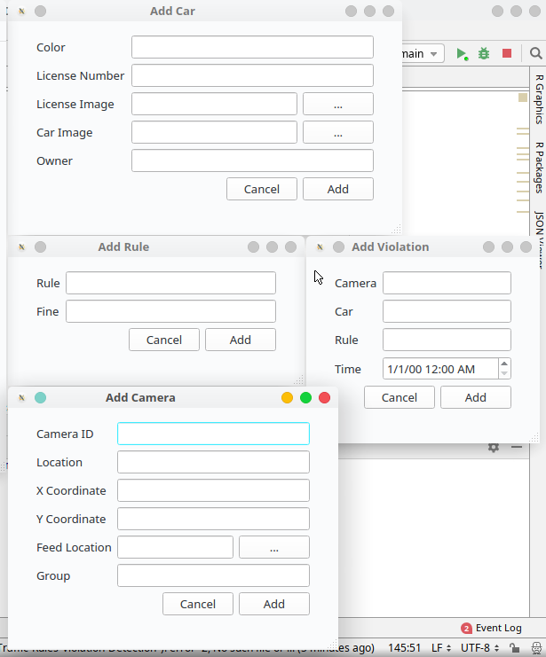

Figure 5: Adding items interface

The graphical user interface (GUI) is designed to facilitate supervision of camera groups. A key feature of the GUI is that it allows the supervisor to:

1. View Rule Violations: The supervisor can access a comprehensive list of rule violations detected by the cameras.

2. Inspect Car Details: For each violation, the supervisor can view detailed information about the car involved, including images and violation records (see Fig-8).

3. File Reports and Tickets: By clicking the detail button for a specific violation, a new window opens, allowing the supervisor to file a report or send/print a ticket for the car owner.

This feature ensures that supervisors can efficiently manage and address rule violations, providing a streamlined process for documentation and enforcement.
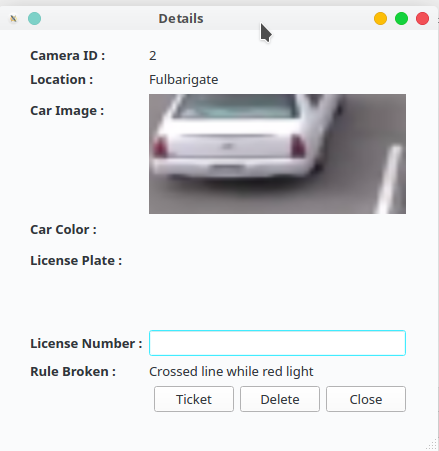

Figure 8: details of rule violation

The graphical user interface (GUI) provides several additional functionalities for record management and searching:

1. Record Deletion and Archiving: Administrators or users can delete records if they identify a false positive. However, records are not permanently deleted; instead, they are marked as archived. If needed, administrators can access the archive window to restore any archived record.

2. Search Functionality: Users can search for vehicle records based on:

* License Number: With text prediction to assist in accurate entry and ensure the license number exists.
* Color: To find vehicles based on their color.
* Date of Rule Violation: To locate records of violations on specific dates.
  
These features ensure effective record management and make it easier for users to retrieve and verify information as needed.
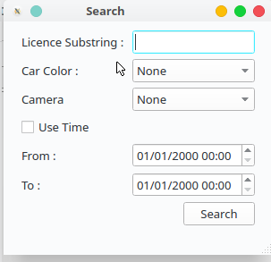

Figure  9: Searching a car or rule violation

### Rules violation video representation in UI

The system currently addresses the following traffic violations:

**1. Signal Violation:** Detects instances where vehicles fail to adhere to traffic signals, such as running a red light.
**2. Parking Violation:** Identifies improper parking behaviors, such as parking in restricted areas or double-parking.
**3. Direction Violation:** Monitors violations related to incorrect driving directions, such as going the wrong way on a one-way street.

These rules are integrated into the system to ensure comprehensive traffic enforcement and monitoring.

**Signal Violation Detection**
To detect signal violations, the system utilizes a straight line in the camera’s field of view. The process works as follows:

* Detection Mechanism: When the traffic light is red, the system monitors the straight line in the image. If a vehicle crosses this line during the red light, it is flagged as a violation.
* Data Registration: A picture of the violating vehicle is captured and registered in the database along with relevant environmental values (e.g., timestamp, light conditions).
* Live Preview: Users can view a real-time preview of the camera feed, allowing them to see which cars are being detected and tested for crossing the line.

This setup ensures timely and accurate detection of signal violations, enabling effective traffic enforcement.
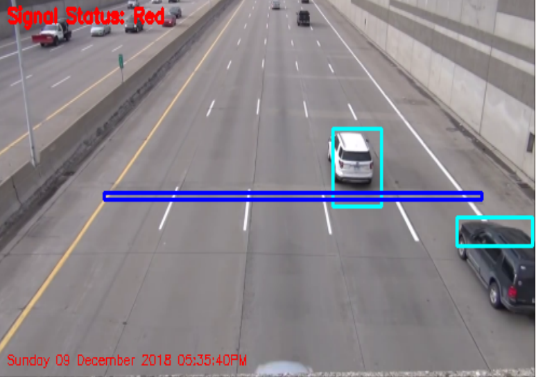

Figure  11: Signal violation camera representation

**Parking Violation Detection**
To monitor parking violations, the system uses a preconfigured rectangular area to define restricted parking zones:

* Rectangle Setup: The restricted parking area is marked as a rectangle within the camera's field of view.
* Violation Detection: If a vehicle remains within this rectangular zone for longer than a predefined duration, it is considered to be in violation of parking rules.
* Data Registration: An image of the vehicle, along with other environmental values (e.g., timestamp, area details), is captured and registered in the database.

This approach ensures that vehicles parked in restricted areas are accurately detected and recorded for further action.

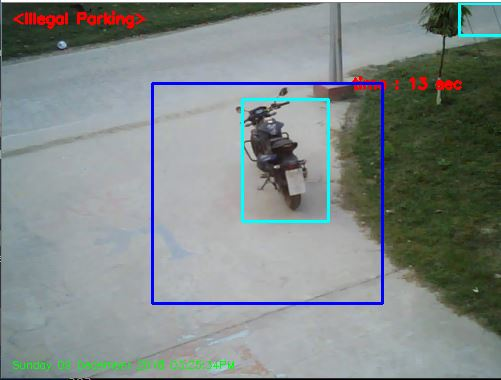

Figure  12: Parking violation camera representation

**Direction Violation Detection**
To detect direction violations, the system employs a method involving predefined lines that divide the camera’s field of view into distinct regions:

* Region Division: The camera’s view is segmented into multiple regions using drawn lines.
* Direction Measurement: As a vehicle moves from one region to another, the system measures its direction of travel.
* Violation Detection: If the vehicle's movement is in the wrong direction according to the defined traffic rules, it is flagged as a violation.
* Data Registration: The violation, along with relevant environmental values, is registered in the database for further processing.

This method ensures that incorrect directional movements are detected and recorded accurately.

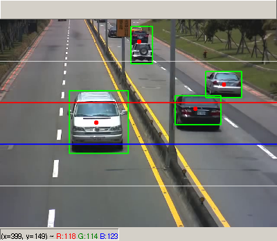

Figure  13: Direction violation camera representation

### Libraries used for graphical user interface:

1. PyQt5: Utilized for developing the graphical user interface (GUI) of the application. PyQt5 provides a set of Python bindings for the Qt application framework, enabling the creation of rich and interactive interfaces.
2. QDarkStyle: Applied to give the PyQt5 interface a modern dark theme. QDarkStyle helps enhance the visual appeal and user experience by providing a consistent and sleek dark color scheme.
3. PyQtTimer: Used for managing timing-related functionalities within the PyQt5 application. PyQtTimer facilitates tasks such as periodic updates and time-based actions in the GUI.

## Licensing

The code in this project is licensed under GNU GPLv3 license.
